# Clean-Energy
🚨**Required** 

- No doubt that the world suffers under the heavy burden of the the dirty energy and its side effects causing some parts of the world to experince unusual weather change. The Global Warming is just a sign of ho much damage we as investors have done by using the dirty energy resources including oil and coal.
- Clean-Energy sources offers the alternatives towards a world powered by clean and renewable energy. The sources of the clean energy are at the reach of every country and it application fieds are increasing tremdously. Enjoy reading and inform yourself about the sources available to the whole world and take a deep dive into each source and its components, application fields, the problem it solves and challenges by implementing.

The website looks as following screenshot done using **am I responsive here** [Clean Energy](https://ui.dev/amiresponsive?url=https://alalimazen.github.io/Clean-Energy/index.html)

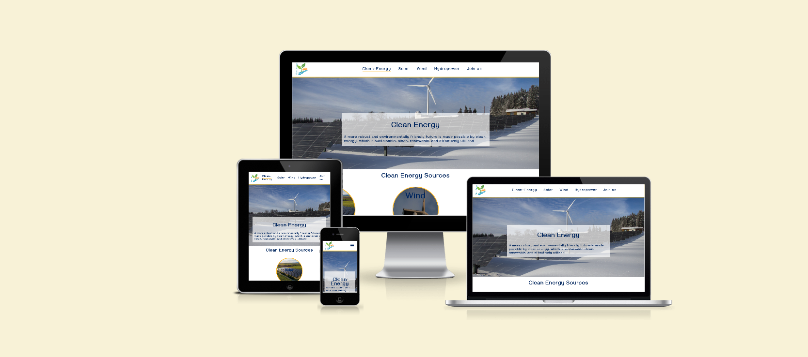

## Live Site
🚨**Required** 

- live overview can be shown when cllicking [Clean Energy](https://alalimazen.github.io/Clean-Energy/)

## Repository
🚨**Required** 

- Clean Energy website Reposiory is availbe on GitHub under [Clean-Energy](https://github.com/AlAliMazen/Clean-Energy)

## Author
🚨**Required** 

Mazen Al Ali 

<small><i><a href='http://ecotrust-canada.github.io/markdown-toc/'>Table of contents generated with markdown-toc</a></i></small>
- [Clean-Energy](#clean-energy)
  * [Live Site](#live-site)
  * [Repository](#repository)
  * [Author](#author)
- [UX](#ux)
  * [Target Audience](#target-audience)
  * [Project Goals](#project-goals)
  * [User Stories](#user-stories)
    + [Site User Stories](#site-user-stories)
    + [Website Owner Stories](#website-owner-stories)
    + [Developer Stories](#developer-stories)
  * [Design Choices Stories](#design-choices-stories)
    + [Colors](#colors)
    + [Typography](#typography)
    + [Imagery](#imagery)
    + [Animations and Transitions](#animations-and-transitions)
  * [Site Structure](#site-structure)
- [Deployment](#deployment)
  * [Deploy to GitHub Pages](#deploy-to-github-pages)
  * [Deploy locally](#deploy-locally)

<small><i><a href='http://ecotrust-canada.github.io/markdown-toc/'>Table of contents generated with markdown-toc</a></i></small>

  # UX
🚀 **merit & beyond**

UX and why you choose or write what I did is still TODO

## Target Audience
🚀 **merit & beyond**

All who are interested in investing in the green, renewable and sustainable energy resource and need a slight over the systems and the technologies used at very wide scope.

Domestic communiites who want to start investigating about the effectivness of replacingcurrent energy sources which comes from dirty ources including oil, coal or fossils with clean and renewable sources. It helps them drawing a path towards a decision making orientation.

## Project Goals
🚀 **merit & beyond**

1- Clear and immersive overview on the clean energy resources.
2- Applications fields along promlems solved by clean Nergy resouces
3- Challenges to each resources and barriers prevents from implementing.

## User Stories
🚀 **merit & beyond**

**I don't get it here what I should write**

This section lists outs as a X I want Y, so I can Z format. It helps drive out the features you will build.

You can have many kinds of users so feel free to have one section or the subsections listed or more

### Site User Stories
🚀 **merit & beyond**
**I don't get it here what I should write**

### Website Owner Stories
🚀 **merit & beyond**
**I don't get it here what I should write**

### Developer Stories
🚀 **merit & beyond**

## Design Choices Stories
🚀 **merit & beyond**

### Colors
🚀 **merit & beyond**

- As the website discuss the concept of clean, renewable and sustainable energy resources, I start think of nature and its reneable sources. The first color comes in mind is therefor a green where solar system can be applied and constructued on covering green areas without effecting their fertiity for reuse. The sun has a strong dark and light yellow and this is where it comes to the first color to reflect the solar system page. As the sun is the strongest sources, I decided to make the background and hover effects takes their identity from this color.
- Wind blows but with no color, this is where the clean and white color comes in making a high contrast for the text above it.
- As a third color used for fonts and titles, I used the dark and light blue because it reflects the azure color of flowing water and it is also the color of solar panels.

- A combination dark yello, light yellow , dark blue and light blue along with white can be seen in the logo which I designed on canva website.

- The colour pallete can be found on [coolors.co](https://coolors.co/palette/00296b-003f88-00509d-fdc500-ffd500)

following screenshot shows the colour theme with its hex-values
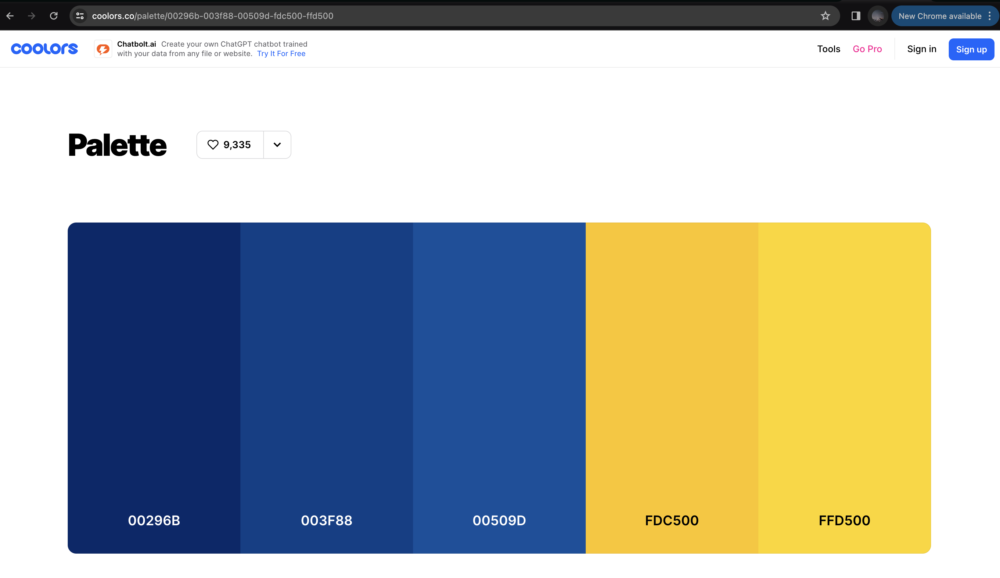

### Typography
🚀 **merit & beyond**

- discuss font size, font types for headers vs buttons vs general text and how it ties into users' emotions or target audience.
- Clarity of letters, putting a capital i next to a lower case L is always a good test
- include screenshots of fonts used and links to the appropriate website ex) https://fonts.google.com/specimen/Raleway

### Imagery
🚀 **merit & beyond**

Based on the topic of clean energy, each image included on the website serves nothing but introduce the visiter to see the applied system on real life projects. Following image indicates without any dout that wind energy is produced using wind turbine which has a tall and high tower with three blades and a rotator installed behind the blades. 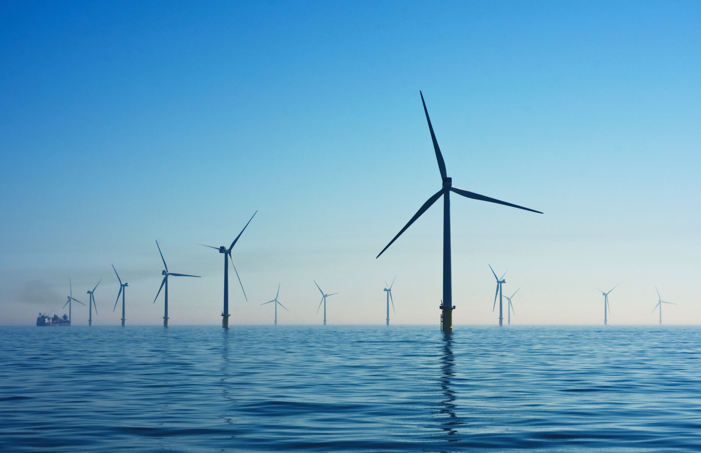

On the other hand, the home page has a hero image which combines solar panels, wind turbines and snow which when melt will cause water flow that is the main stream for hydropower source 

### Animations and Transitions
🚀 **merit & beyond**

- discuss any special animations or transitions you've included 
- special hover state effects

## Site Structure and Features
🚀 **merit & beyond**

- The clean energy website is built with the idea in mind that the visiter starts totally smoothly by giving a glance about what clean energy is and an where to find its sources, moving to its applications and sum it up by a video about why to move toward clean energy.

- The website is a multi-page version with clean-energy as home and landing page. It consists of four other pages; that are, solar, wind, hydro power as they are main types of clean energy forms and a fourth join-us which includes a form where user can enter his/her infos and click the submit button.

- From the main page, user can either choose to head directly to the other sub-pages using the navigation bar which is completely resonsive to mobile screens or larger screens. Navigation uses hover effect and shows an underlined title for the active page or scroll to see 3 circles which has titles linked to the energy source. 

- The 3 Energy sources presented as circleson the website have hover effects on larger PC or laptops and when user hover over one circle the cursor turn to be a pointer , more text will be shown, the background trun to certain predefined colour and the border gets a drak blue coloured also predefined to give a visual indication that it can be clicked as in the following screen
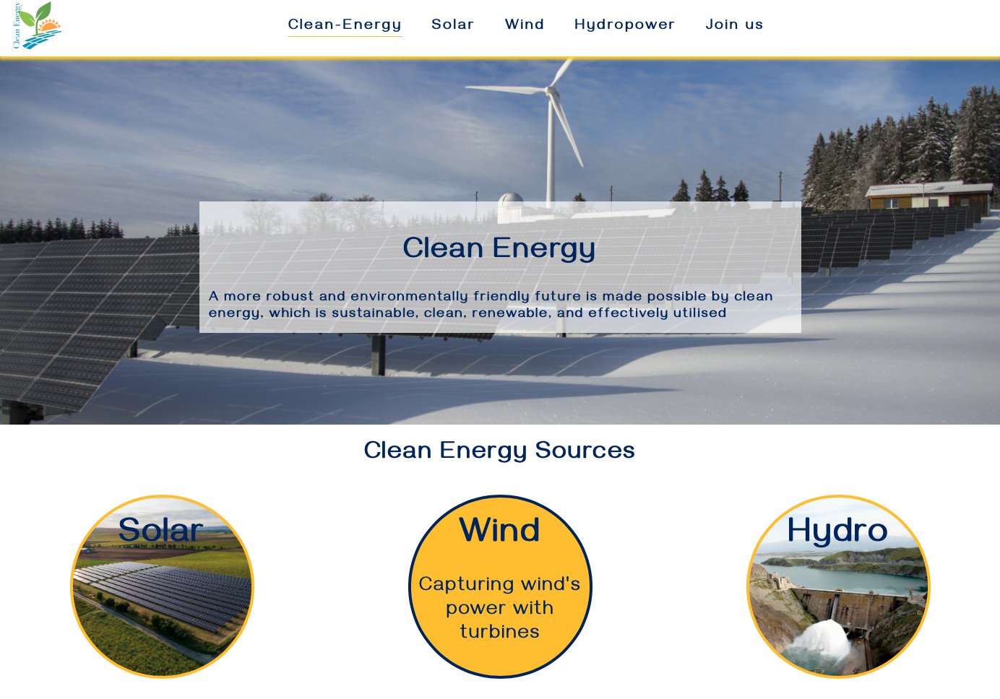

- Moving on visiter will be presentet to two unordered lists explaining why clean energy good is and where it can be applied
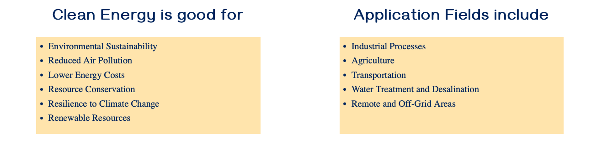

- As last section on the home page, a short video posted by **the Economist** explaining our need to move towards **Clean Energy** in order to avoid the drastic climate changes.

- Pages like Solar, Wind and Hydropower are made up of the same structure. Each page has its own **hero image with cover text** based on the system and two other sections. The first is about the **How it works** and the second is the **System Components**
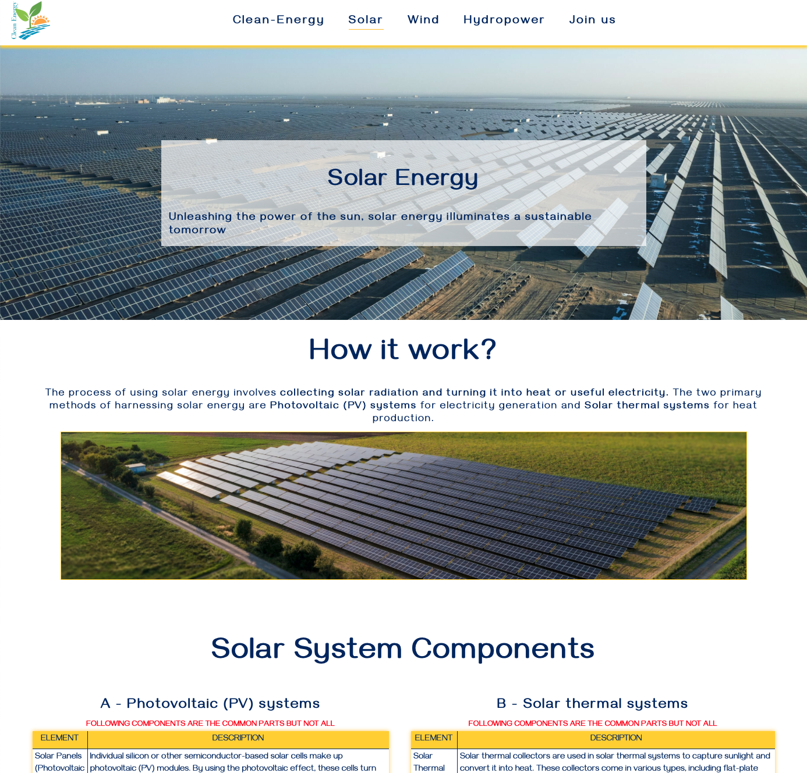

As we can see from the above screen the table/s have also a box-shadow effect indicating that they are not floating but rather they have their own centered position and border

- Join us page is where user can write his personal information and his/her choices of preferred energy system and click on the submit button.
Fields used to collect personal data are defined as required fiedls meaning that user can leave any field empty and submit the form. Moreover the button gets used of the hover effect on PC or laptops screens.
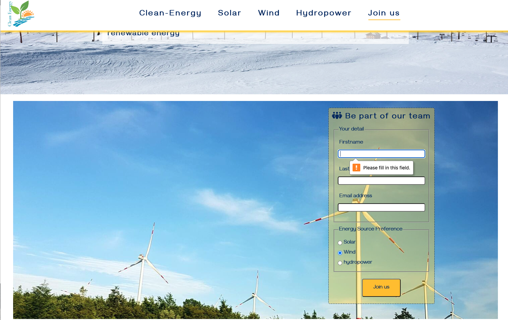

- The Footer provides external links to social media websites including facebook, youtube, X (twitter before), intsagram regardless where from user views the website. It is worth mentioning that both header and footer have a box-shadow to the bottom and to the top respectively to indicate their dimentions

Footer on Desktop: 
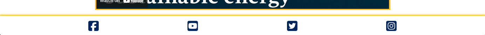

Footer on mobile : 
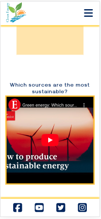

- Finally the website provides a 404 Page not found mechanism provided by GitHub. The 404 page can be accessed when user types a non-existing page on the website. User will land a custom 404 page where it provides a click link to go back to the clean energy home page as in the following screen.

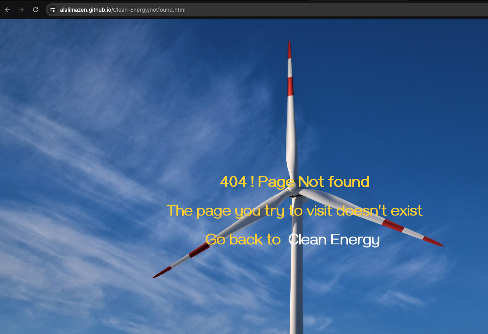

**Note**

From any where in the webiste, user can click on the logo to go back to the home page.

## Testing

### While Development

  - While coding the website I mainly used Google Chrome Version 120.0.6099.216 (Official Build) (arm64) along with its amazing Development tools which helps debugging and styling every single elements

  - I tested the online version deployed on gitHub on different web browser including the following :

    1- Safari Version 17.2.1 (19617.1.17.11.12)
    2- FireFox Developer Edition Version 122.0b9 (64-bit)
    3- Microsoft Edge Version 120.0.2210.133 (Official build) (arm64)
  
  - I confirm that the website is responsive and fonts are readable with on the commonly used devices provided by Google Chrome for testing purposes including 
    
    1- iPhone SE
    2- iPhone XR
    3- iPhone 12 Pro
    4- iPhone 14 Pro Max
    5- Pixel 7
    6- Samsung Galaxy S8+
    7- Samsun Galaxy S20 Ultra
    8- iPad Mini
    9- iPad Air
    10- iPad Pro
    11- Galaxy Fold (starting point)

  Website is first developed with mobile-first concept. Then moved to the break point tought in the course.

### Bugs and Known Issues

As a note I need to make it clear that during the development process I commited many Fixes but these are related to the styles and not as last version. Though the following are shown through many version of website development. 

**GitHub Issues are used to track any bugs related to the website** 

- Still unsolved is a bug related to the birder of the button on the join us page form. It is supposed to have a color of #002968 (dark blue), though it shows a white border around the button on real mobile devices including iPhone Pro Max running iOS 17.0.1

- After using the HTML W2C validaor there was an issue caused by the meta attribute
  
    meta http-equiv="X-UA-Compatible" content ="IE=7"

    The bug is solved using the value of content IE=edge which will tell the browser to use the latest version availbel of MS Edge to render the content. This Issue is listed on the Issues page on  the Clean-Energy Repository. 
  Status of this issue is solved.

  
### Code Validators

1- HTML : I have used [W3C](https://validator.w3.org/) to check my code and all pages are labeled as **error free** :

- index.html 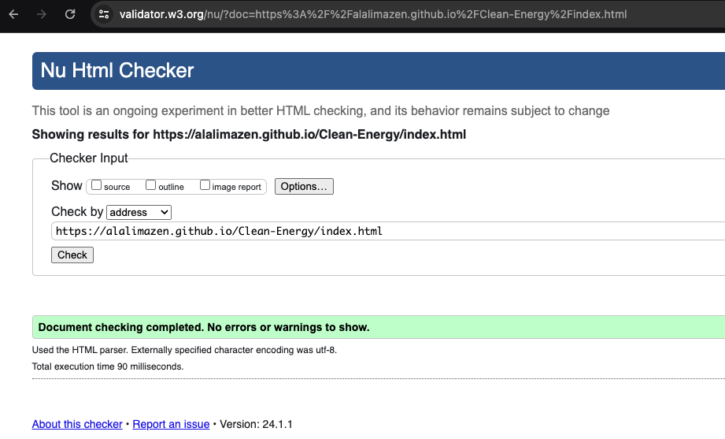

- solar.html 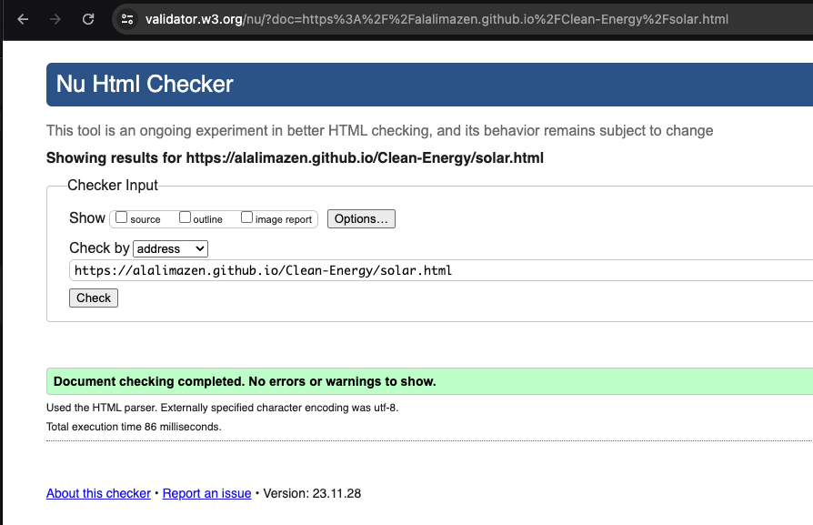

- wind.html 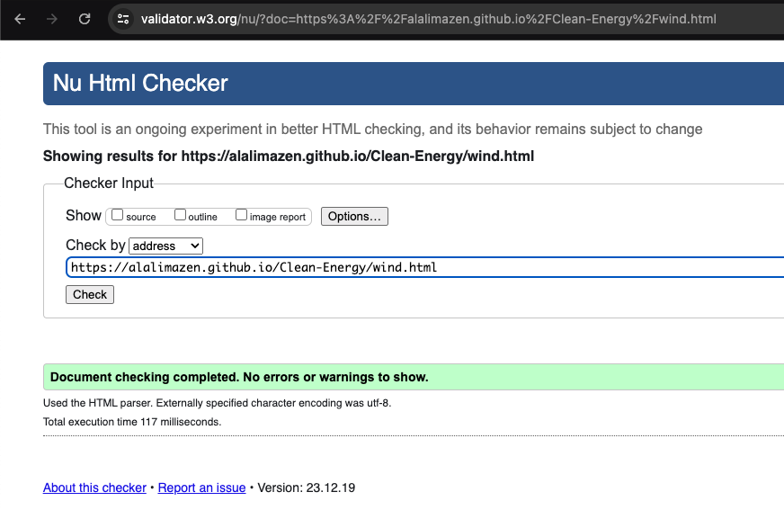

- hydro.html 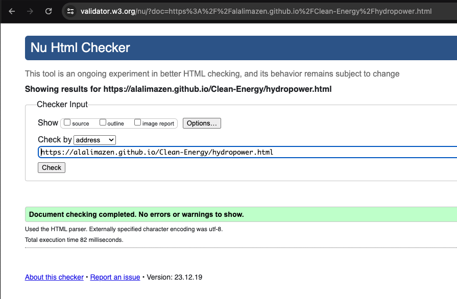

- joinus.html 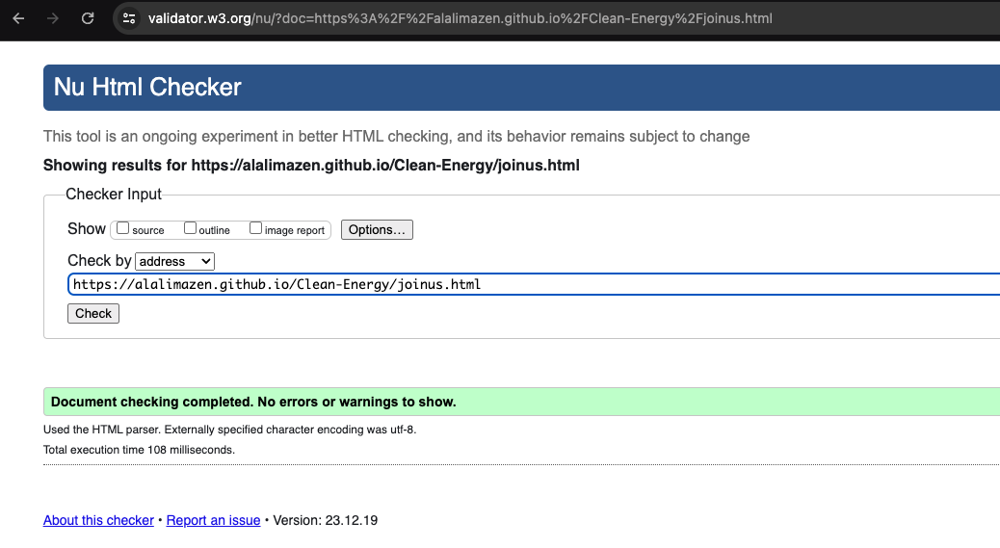

2- CSS: I have use [W3.org](https://jigsaw.w3.org/css-validator/) as recommended by Code Institute to check my website style code and it shows no errors:
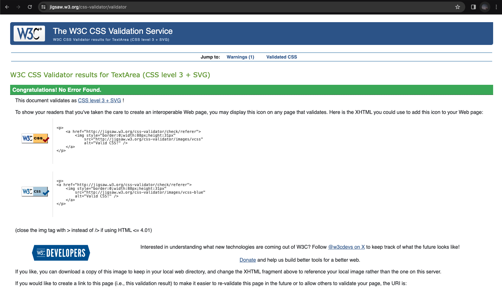

3- Accessiblity: I used the lighthouse tool provided by Google Chrome on all the html pages

- index.html

## Deployment
🚨**Required** 

### Deploy to GitHub Pages
🚨**Required** 

Based on the the course content, I applied the following steps to deploy my website to **GitHub Pages**:

1- Log in to GitHub using own credentials (username and password)

2- Head to the desired repository (in my case it is under [Clean-Energy](https://github.com/AlAliMazen/Clean-Energy) )

3- In the menubar click on the **Settings**

4- On the left hand side click Pages menu item 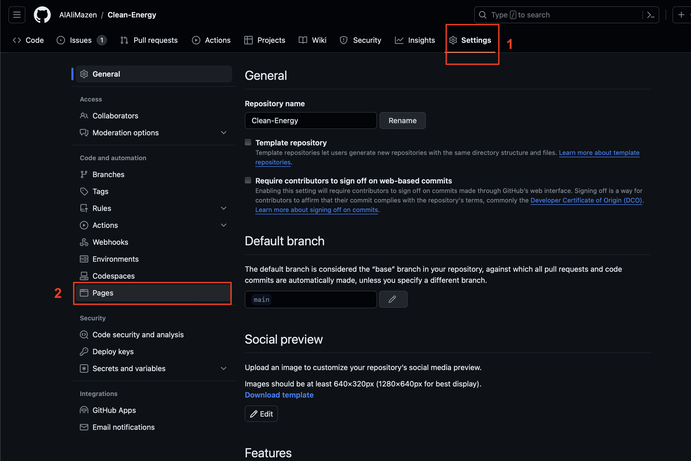

5- Under **Build and Deployment** you can see **Sources** where you need to choose the option **Deploy from branch**

6- Last but not least under **Branch** choose the **main** branch if it is master and release version of the project.
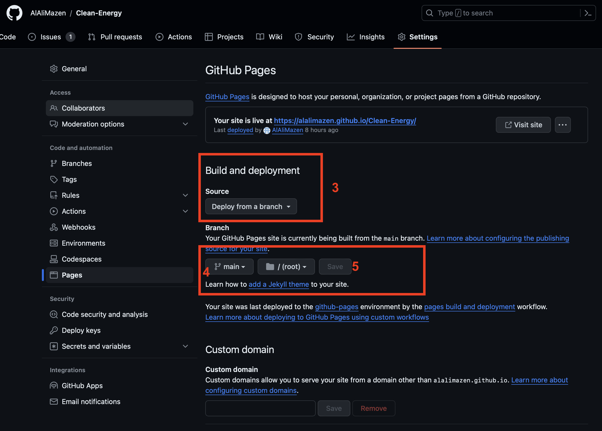

7- Finally click on **Save** and GitHub will do the rest.

Bilding the project and deploying it for public may take several minutes depending on the size of the project. On the main repository page, we can see the **Deployment** section when the project is read to be accessed as a final poduct.
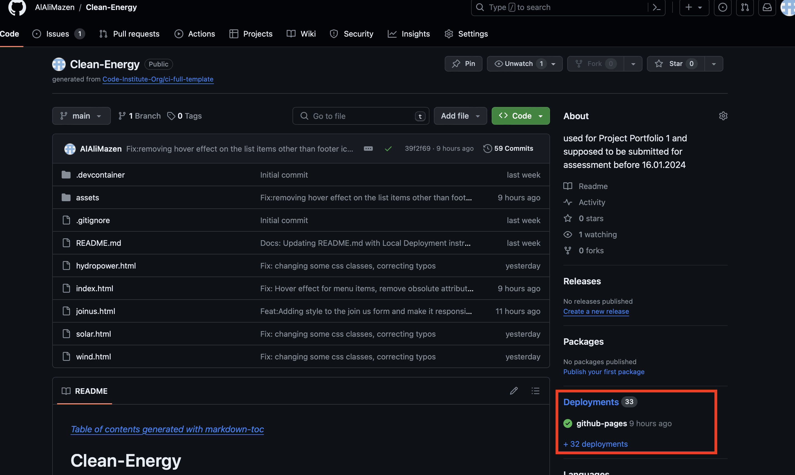

### Deploy locally

I commonly use VS Code as my choice of ID. It is the same as the Codeanywhere with the difference that the later runs online using docker im background. 

I managed to clone my GitHub Repo for my project following the steps listed below:

 1. Open VS Code IDE and the Interface will show an option for "Cloning a repository"
 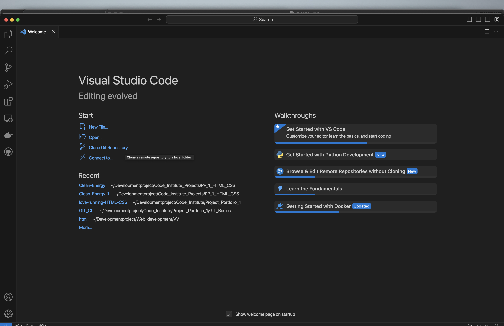

 2. From GitHub Repository page, click on the Code page and copy the https URL to the clipboard
 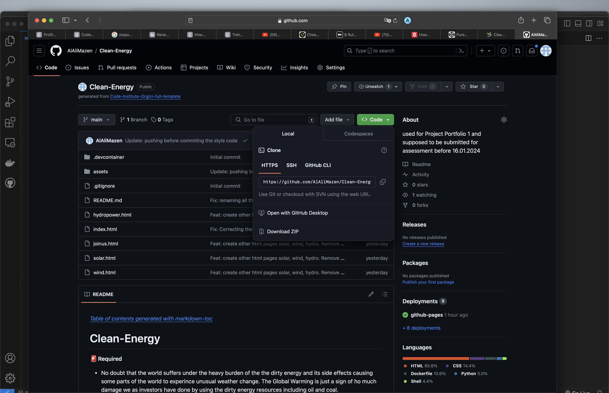
 
 3. Paste the URL of the Repo in the VS-Code after clicking on the **Clone Git Repositoy** option as in the following screen shot:
 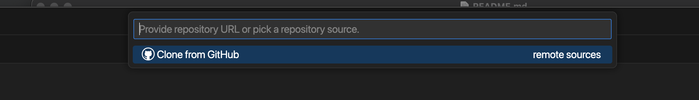

 4. On the left hand side of the VS-Code, you will see the GitHub Fork Icon has synchronised the files and brought them to your local machine. It will ask you to choose a **local repository** to save the cloned files/project.

 5. Choose a disred direcotry to save the project and the cloned files will show up in the VS-Code
